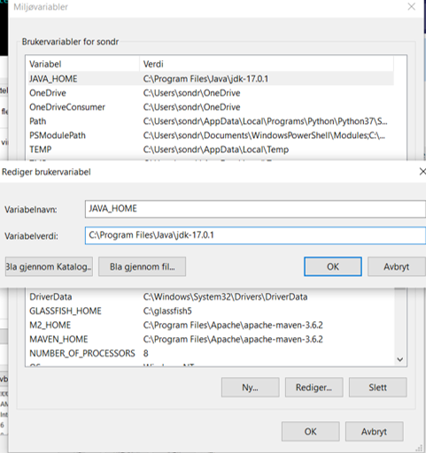

# Oppsett av Java, Git og Visual Studio Code
_Dette dokumentet beskriver hvordan du installerer programvaren du trenger for INF101 - vår 2022._

Målet med denne guiden er å installere

- [Java](#installere-java)
- [Visual Studio Code](#visual-studio-code)
- [git](#git)

**Du er ferdig når du har opprettet og kjørt HelloWorld.java fra et terminalvindu og [Hello World prosjektet](https://git.app.uib.no/ii/inf101/22v/) i Visual Studio Code, og JUnit testene i Visual Studio Code er passerer**.

<a name="installere-java">

## 1) Installere Java
Vi bruker [Java](https://en.wikipedia.org/wiki/Java_(programming_language)) i kurset, selv om de fleste versjoner av Java vi kommer til å lære i dette kurset har vært der siden Java 8 anbefales det alltid å ha nyeste versjon av Java. Java 17 kom ut i september 2021 så det er denne vi vil bruke i dette kurset. **Merk**: De fleste Java-brukere er kjent med Oracle sin JDK, men i dette emnet vil vi bruke OpenJDK.

For at Java skal virke er det 2 hovedmomenter som må være på plass:
- En mappe som heter jdk-17.0.1 eller lignende må finnes på PCen, inne i den vil det finnes blandt annet 2 filer som heter java.exe og javac.exe
- PCen må vite hvor denne mappen er slik at når du skriver en kommando så finner PCen rett fil. Dette gjøres litt forskjellig avhengig av operativsystem.

Sjekk om du har Java installert ved å gå til et terminalvindu og skrive `java -version`. Dersom du har Java installert vil du få vite hvilken versjon. Dersom du får `command not found` eller tilsvarende, eller en lavere versjon enn Java 17 (f.eks. 8 eller 9) må du installere nyeste versjonen.


```
> java -version
command not found: java
```

### Windows
1. Åpne Filutforsker og naviger deg frem til ``C:\Program Files``. Hvis det ikke finnes allerede opprett en mappe med navn "Java".
2. [Klikk her for å laste ned Java 17](https://jdk.java.net/17/). Velg ``Windows / x64`` (zip). 
3. Høyreklikk zip-filen og velg "Pakk ut". Velg Java-mappen du opprettet i steg 1: ``C:\Program Files\Java``.
4. Legg til "path variable" for Java.
    - I søkefeltet ned til venstre (Windows søk) skriv "Vis avanserte Systeminnstillinger" og trykk ``enter``.
    - Trykk på ``Miljøvariabler``

    

    - Under "Brukervariabler for <ditt brukernavn>" trykk på ``Ny``. Variabelnavn: ``JAVA_HOME`` og Variabelverdi: ``C:\Program Files\Java\jdk-17.0.1``.

    

    - Under "Systemvariabler" dobbelklikk variabelen "Path". Trykk "Ny" og skriv inn ``C:\Program Files\Java\jdk-17.0.1\bin``

    
    
    - Trykk "Ok" til alle vinduer er stengt.

Når du er ferdig med installasjonen kan du kjøre `java -version` kommandoen igjen *i et nytt terminalvindu*, og sjekke at versjonen er riktig.

```
> java -version
openjdk version "17.0.1" 2021-10-19
OpenJDK Runtime Environment (build 17.0.1+12-39)
OpenJDK 64-Bit Server VM (build 17.0.1+12-39, mixed mode, sharing)
```

✅ Når `java -version` kommandoen gir versjon 17 kan du gå videre.
</a>

### Troubleshooting
- Dersom terminalvinduet ikke forstår kommandoen (command not found eller lignende) etter Java er installert, kan du prøve å starte et nytt terminalvindu og se om det fungerer der.
- Har du ikke Windows men likevel problemer med path se [her](https://www.baeldung.com/java-home-on-windows-7-8-10-mac-os-x-linux).

## Kjøre Java
### 2.1) Kjøre HelloWorld.java i et terminalvindu
Når du har installert Java kan du kjøre et javaprogram fra terminalen.

Lag en ny fil på en valgfri lokasjon, med et valgfritt _tekstredigeringsverktøy_ (f.eks. Notepad++, Text Edit, TextPad, Atom eller Visual Studio Code), og navngi filen "HelloWorld.java". (Filnavnet skal **ikke** ende med .txt).

Inni filen kan du lime inn det følgende Java-programmet:

```java
public class HelloWorld {
	public static void main(String[] args) {
		System.out.println("Hello World!");
	}
}
```

Fra terminalen kjører du HelloWorld.java ved å bruke kommandoen

```
> java HelloWorld.java
Hello World!
```

For å kjøre java-filen din fra terminalvinduet må du enten navigere dit den er, eller bruke fullstendig adresse. Det enkleste er ofte å navigere til riktig sted først. Hvis du prøver å kjøre den uten å være på riktig sted vil du få en feilmelding:

```
> java HelloWorld.java
Error: Could not find or load main class HelloWorld.java
Caused by: java.lang.ClassNotFoundException: HelloWorld.java
```

### Troubleshoothing
TextEdit vil ofte lage nye filer i RTF-format (tilsvarende som Word-filer). Når du skriver kode ønsker du å bruke _rene tekstfiler_. Gå til innstillinger i TextEdit og velg ren tekstfil, og opprett så en ny fil som du bruker herfra.

### 2.2) Kommandoer for terminal-navigering
I terminal-vinduet navigerer du ved hjelp av kommandoen `cd` etterfulgt av navnet på mappen du vil gå _inn i_, eller `..` dersom du vil gå _ut_ av mappen du er i.

`cd INF101` vil forsøke å navigere deg _inn i_ en mappe INF101 som ligger i mappen du er i. Hvis INF101 ikke finnes i mappen du er i, vil du typisk få feilmeldingen `cd: no such file or directory: INF101`.

`cd ..` vil forsøke å navigere deg _opp_ et nivå, ut av mappen du er.

`ls` for Mac/Linux og `dir` for Windows er en kommando for å liste opp alle filer og mapper i mappen du er i. Dette er nyttig for å se hvilke mapper og filer som finnes der.

✅ Når du får til å skrive ut `Hello World!` fra terminalen kan du gå videre.

#### Troubleshooting
NB: Disse to kommandoene vil ikke ødelegge, slette eller endre noe på PCen din. De er derfor trygge å eksperimentere med. Hvis du roter deg vekk i terminalen din kan du alltid bare lukke den og åpne en ny.

<a name="visual-studio-code">

## 4) Visual Studio Code
Vi bruker [Visual Studio Code](https://en.wikipedia.org/wiki/Visual_Studio_Code) til utvikling i dette kurset. De som har fullført INF100 de siste to årene burde allerede ha Visual Studio Code installert. Hvis ikke kan du laste det ned her: [https://code.visualstudio.com/download](https://code.visualstudio.com/download).

For å hjelpe oss skrive Java-kode vil vi installere en extension kalt "Extension pack for Java". Inne i Visual Studio Code trykk på "Extensions" i kolonnen til venstre og søk "Extension pack for Java". Trykk på ``Install``.

</a>
<a name="git">

## 4) git

GitLab er en av mange git-servere som gjør det enkelt for flere å samarbeide på et kodeprosjekt ved å bruke git.
Git er et versjonskontroll verktøy som hjelper deg å ta vare på koden. Du kan finne tilbake til forrige versjon og skulle du miste noe data å PCen din så ligger alt i backup på serveren.

### 4.1) Installere git

Vi bruker [git](https://en.wikipedia.org/wiki/Git) for å levere ut oppgavekode i dette kurset. Vi anbefaler at du bruker det når du koder selv for å sikre deg at du ikke mister det du har gjort. git er meget populært i næringslivet, og er et verktøy du får mye igjen for å lære deg skikkelig. Du vil heldigvis få mange anledninger til det i INF101.

Sjekk om du har git installert ved å skrive `git` i et terminalvindu. Dersom du har git installert vil du få `usage: git` og en oversikt over mulige argumenter. Dersom du får `command not found` eller tilsvarende må du installere git.

```
> git
command not found: git
```

[Klikk her for å laste ned og installere git](https://git-scm.com/downloads). Velg ditt operativsystem og kjør den nedlastede filen.

Når du er ferdig med installasjonen kan du kjøre `git` kommandoen igjen, og sjekke at du får oversikt over git kommandoer.

```
> git
usage: git [--version] [--help] [-C <path>] [-c name=value]
           [--exec-path[=<path>]] [--html-path] [--man-path] [--info-path]
           [-p | --paginate | --no-pager] [--no-replace-objects] [--bare]
           [--git-dir=<path>] [--work-tree=<path>] [--namespace=<name>]
           <command> [<args>]
```

✅ Når kommandoen `git` gir deg utskriften vist over kan du gå videre.

### 4.2) Git server

Uib har sin egen GitLab server, før du får tilgang til den må du opprette konto der.

Gå til [https://git.app.uib.no/](https://git.app.uib.no/) . Logg inn med Dataporten, **IKKE MED Github**. Brukere med Github vil ikke gis tilgang.
Da blir en konto laget for deg på Gitlab. Viktig: du skal ikke endre det automatiske brukernavnet du får.
Hvis du endrer brukernavn vil du ikke få tilgang til øvelsene i kurset.
Hvis du ved et uhell har byttet brukernavnet ditt, må du bytte det tilbake til samme som din UiB-mail.
For eksempel:
hvis din mail er Fornavn.Etternavn@student.uib.no, skal brukernavnet på gitlab være Fornavn.Etternavn.
Du bytter brukernavn her: [https://git.app.uib.no/profile/account](https://git.app.uib.no/profile/account) .

### 4.3) INF101 gruppe på GitLab

Når du er logget på GitLab, klikk denne linken:
[https://git.app.uib.no/ii/inf101/21v/students](https://git.app.uib.no/ii/inf101/21v/students)

Klikk på "Request Access"
Du vil automatisk få tilgang til gruppen etter noen minutter, hvis ikke må du kontakte gruppeleder.

Når vi lager ukesoppgaver og obligatoriske semesteroppgaver kopieres disse inn på deres private git resository.
Derfor finner dere de tilgjengelige oppgavene på https://git.app.uib.no/ii/inf101/21v/assignments

### 4.4) Sette opp ssh key

Det finnes flere måter å logge inn når man bruker git, men det å skrive brukernavn og passord hver gang man har gjort noen endringer er unødvendig.
En ssh key lagres på PCen slik at hver gang du ber om tilkobling til en server så sjekkes ssh key istedenfor å be om passord.

Inne på GitLab trykker du på brukerikonet helt oppe til høyre og velger settings, i menyen til venstre dukker da opp SSH keys.
Her trykker du på "generate one" og følger instruksjonene.

### Troubleshooting

En ssh key lagres på PCen, hvis du har 2 PCer må du gjøre dette på begge PCene.

</a>

## 5) Importere er prosjekt inn i Eclipse

Eclipse har innebygget støtte for git som kan brukes, men git kan også brukes uavhengig av Eclipse.
Her forklarer vi hvordan du bruker git separat siden det er den måten som er lettest å forstå.
Det betyr 2 steg, først laste ned en kopi til en mappe på din PC, og så importere det prosjektet inn i Eclipse. 
Hvis dere vil bruke Eclipse til å importere kan dere følge denne [guiden](https://tools.jboss.org/documentation/howto/git_import_projects.html#clone_uri)

### 5.1) Klone Hello World prosjekt fra GitLab repo

Du skal nå bruke git i terminalvinduet til å laste ned - eller klone - Java-prosjektet [Hello World project] fra UiB sin GitLab server. Et Java-prosjekt er ikke noe mer magisk enn en mappe med blant annet Java-filene i tillegg er det en POM-fil som beskriver Maven prosjektet. 

Når du kloner et prosjekt så hentes mappen med alle filene ned til din maskin. Klone-URLen er nesten den samme som til nettsiden 
(du finner også denne linken ved å trykke prosjektet inne på GitLab og så på den grønne "Clone"-knappen på Github-siden):

https://git.app.uib.no/ii/inf101/21v/assignments/Fornavn.Etternavn_lab0.git

Naviger deg til en mappe du vil laste ned prosjektet til i et terminalvindu, og klon ved å bruke kommandoen

`> git clone [lim inn adresse for dit prosjekt her]`

Når kloningen er ferdig må du sjekke at Java-prosjektet ligger i den mappen du befinner deg i. Bruk `ls` / `dir` og sjekk at det ligger en ny mappe "lab0" der. Bruk kommandoen `cd lab0` for å navigere deg inn i prosjekt-mappen. Bruk kommandoen `ls` / `dir` igjen for å sjekke at filen `pom.xml` ligger i mappen.
Du kan også bruke filutforskeren og klikke på rett mappe.

#### Troubleshooting

- Når du kloner fra et git-repositorie så lastes filene ned over nettet. Du må derfor ha en aktiv internett-tilkobling.
- Filene vil lagres i mappen du befinner deg i når du skriver kommandoen.
- Google is your friend: for å finne ut av eventuelle rare feil er det lurt å copy-paste dem til Google og se hva slags løsninger andre foreslår.

### 5.2) Importere Hello World-prosjektet i Eclipse

Et IDE kan hjelpe oss å automatisk sette språk-versjoner og test-versjoner til det prosjektet trenger. Vi bruker filen `pom.xml` til å beskrive hvilken Java-versjon og JUnit-versjon Eclipse skal bruke for prosjektet vårt. For å få Eclipse til å lese instillingene fra pom-filen, må vi importere prosjektet som et _Maven-prosjekt_.

Finn menyen **Import** -> **Existing Maven Projects**.

_Root Directory_ skal peke til den mappen som `pom.xml` ligger i. Du kan sjekke hvilken mappe det var i terminalvinduet du brukte i 5.1. Når du finner riktig mappe i Eclipse sin import _wizard_ vil **/pom.xml** vises under **Projects:** og du kan huke av sjekkboksen for at du vil importere det og trykke **Next**.

Klikk deg gjennom menyen til prosjektet dukker opp i Eclipse i Project Explorer-vinduet. Dersom du ikke ser vinduet (eller med et uhell har krysset det vekk) kan du vise vinduet ved å trykke på Window -> Show View -> Package Explorer.

I package explorer kan du se hvilken Javaversion Eclipse linket til prosjektet. Der skal det vises Java 15. Spør en venn, Google, foreleser eller gruppeleder hvis det står en annen versjon enn 15, eller hvis filen din har røde kryss.

✅ Når prosjektet er importert som et Maven-prosjekt og vises i Package Explorer uten røde kryss eller feilmeldinger kan du gå videre.

### 5.3) Kjør Hello World-prosjektet i Eclipse

På samme måte som vi kjørte et Java-program i terminalen i 2.1, skal vi nå kjøre det klonede Java-programmet i Eclipse. Høyreklikk prosjektet i Package Explorer-vinduet. Trykk på **Run as** -> **Java application**. Finn _Consol_ i Eclipse: der skal det nå stå "Hello World!".

✅ Når du har fått "Hello World!" i konsollen i Eclipse kan du gå videre.

### 5.4) Kjør JUnit tester for Hello World-prosjektet i Eclipse

Det siste vi skal gjøre er å kjøre tester for prosjektet vårt. Vi bruker testrammeverket [JUnit](https://www.vogella.com/tutorials/JUnit/article.html), versjon 5. Du trenger ikke installere JUnit manuelt; pom-filen forteller Eclipse hvilken versjon prosjektet skal bruke.

Kjør testene ved å høyreklikke på prosjektet i Package Explorer-vinduet. Trykk på **Run as** -> **JUnit test**. Du vil få opp et JUnit View der de to testene vises som røde hvis de feiler er grønne hvis de passerer.

Sjekk at testene blir grønne (godkjent) i JUnit-vinduet.

_Valgfritt: Dobbelttrykk på en av testene for å åpne filen som testene ligger i (HelloWorldTest.java). Se om du klarer å omtrentlig forstå hva de to testene gjør._

✅ Når de to JUnit-testene kjører og er grønne er du ferdig med installasjonen!

#### Troubleshooting

Se om du finner ut av det sammen med en medelev eller Google. Eventuelt spør på gruppe.
