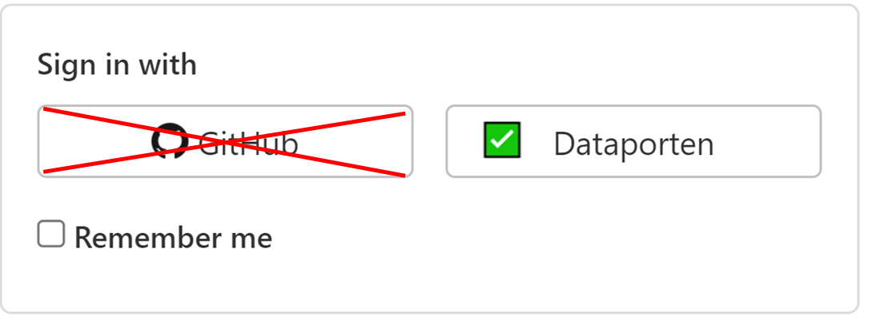

# Oppsett av Java, Git og Visual Studio Code
_Dette dokumentet beskriver hvordan du installerer programvaren du trenger for INF101 - vår 2022._

Målet med denne guiden er å installer og bli kjent med:

- [Java](#1-installere-java)
- [Kodeeditor (IDE)](#2-kodeeditoride)
- [Git](#3-git)
- [GitLab](#4-gitlab)

Når du er ferdig med det, må du 

 - [Gjennomføre laben](#5-selve-innleveringen)

**Du er ferdig når du har:**
 - opprettet og kjørt HelloWorld.java fra et terminalvindu, og
 - din egen fork av dette lab0/Hello World -prosjektet kjører i lokalt i din kodeeditor, og
- JUnit-testene passerer lokalt på din maskin, og
- endringene du har gjort er pushet til ditt lab0-repositore på git.app.uib.no, og 
- du har levert repositoriet på mitt.uib gjennom CodeGrade og den automatiske rettingen gir deg et poeng.


## 1) Installere Java
Vi bruker [Java](https://en.wikipedia.org/wiki/Java_(programming_language)) i kurset. Selv om de fleste elementer av Java vi kommer til å bruke i dette kurset har vært der siden Java 8, anbefaler vi å benytte Java 17, som er nyeste LTS (long-time support) -versjon for øyeblikket. **Merk**: Mange Java-brukere er kjent med Oracle sin kommersielle JDK, men i dette emnet vil vi bruke open source -alternativet OpenJDK.

* [Installere Java 17 for Windows](InstallereJavaWindows.md)
* [Installere Java 17 for Mac](InstallereJavaMac.md)

Linux-brukere kan også følge guiden for Mac.

### Kjøre Java i et terminalvindu
Når du har installert Java kan du kjøre et javaprogram fra terminalen (Windows: PowerShell).

Lag en ny fil på en valgfri lokasjon, med et valgfritt tekstredigeringsverktøy for ren tekst (f.eks. Notepad/Notisblokk i Windows, TextEdit for Mac, Gedit for Ubuntu/Linux eller lignende), og navngi filen `HelloWorld.java`. (Filnavnet skal **ikke** ende med .txt).

Inni filen kan du lime inn det følgende Java-programmet:

```
public class HelloWorld {
    public static void main(String[] args) {
        System.out.println("Hello World!");
    }
}
```

Fra terminalen kjører du HelloWorld.java ved å bruke kommandoen

```
> java HelloWorld.java
Hello World!
```

For å kjøre java-filen din fra terminalvinduet må du enten navigere dit den er, eller bruke fullstendig adresse. Det enkleste er ofte å navigere til riktig sted først. Hvis du prøver å kjøre den uten å være på riktig sted vil du få en feilmelding:

```
> java HelloWorld.java
Error: Could not find or load main class HelloWorld.java
Caused by: java.lang.ClassNotFoundException: HelloWorld.java
```

### Kommandoer for navigering i terminal
I terminal-vinduet befinner du deg til enhver tid i en mappe vi kaller *working directory*. For å navigere mellom mapper er det tre hendige kommandoer vi her introduserer helt kort:
- `pwd`<br/>
Denne kommandoen ("print working directory") vil vise deg hvilken mappe du befinner deg i for øyeblikket.
- `ls`<br/>
Denne kommandoen ("list") vil vise deg innholdet i mappen du befinner deg i.
- `cd mappenavn`<br/>
Denne kommadoen ("change directory") vil flytte deg *inn* i mappen ``mappenavn.'' For å gå *ut* av mappen du er i, bruk kommandoen `cd ..` (inkludert to punktum).

Kommandoene over vil virke i terminalene til Mac og Linux, samt i PowerShell og Git Bash for Windows. *For Windows CMD (ledetekst/command prompt) gjelder det andre kommandoer, så bruk PowerShell for å følge denne guiden.*

✅ **Når du får til å skrive ut `Hello World!` fra terminalen kan du gå videre.**

### Feilsøking
 - Kommandoene `pwd`, `ls` og `cd` vil ikke ødelegge, slette eller endre noe på datamaskinen din. De er derfor trygge å eksperimentere med.
 - TextEdit vil ofte lage nye filer i RTF-format (hvor tekst kan ha ulike fonter, skriftstørrelse, fet skrift og lignende, slik som Word-filer). Når du skriver kode ønsker du istedet å bruke *rene tekstfiler*. Gå til innstillinger i TextEdit og velg ren tekstfil (plain text), og opprett så en ny fil som du bruker herfra.
 
## 2) Kodeeditor/IDE
For å hjelpe oss å skrive kode benytter vi oss av en IDE (Integrated Development Environment). For Java-utvikling er det tre IDE'er vi anbefaler: Eclipse, Visual Studio Code og IntelliJ. I forelesningene kommer hovedsakelig Eclipse og VS Code til å bli brukt, men hvilken som helst vil fungere for deres egen bruk.

### Visual Studio Code
[Visual Studio Code](https://en.wikipedia.org/wiki/Visual_Studio_Code) er en relativt nyutviklet IDE som er utviklet for å kunne brukes med mange ulike språk. Den ble først utgitt av Microsoft i 2015, og har på kort tid blitt enormt populær: i 2021 var dette den foretrukne IDE blant hele 70% av brukerne på StackOverflow, inkludert emneansvarlig Torstein.

De som har fullført INF100 de siste to årene burde allerede ha Visual Studio Code installert. Hvis ikke kan du laste det ned her: [https://code.visualstudio.com/download](https://code.visualstudio.com/download).

For å hjelpe oss skrive Java-kode vil vi installere en gruppe med utvidelser kalt **"Extension pack for Java"**. Inne i Visual Studio Code trykk på "Extensions" i kolonnen til venstre (evt. menyvalg *View -> Extensions*) og søk "Extension pack for Java". Trykk på `Install`.

Tips til Mac/Linux-brukere: installer `code` som kommando, slik at du kan åpne VS Code direkte fra terminalen: https://stackoverflow.com/questions/30065227/run-open-vscode-from-mac-terminal. For Windows-brukere skal dette virke automatisk.


### Eclipse
[Eclipse](<https://en.wikipedia.org/wiki/Eclipse_(software)>) er en annen IDE som er populær blant Java-utviklere. Utgitt først i 2001 av IBM er dette en IDE som er spesialdesignet for Java. Den er også i stor grad utviklet i Java selv. Dette er en IDE som har vært populær over lang tid, og som har et enormt utvalg av plugins for Java-utvikling. Det er også den foretrukne Java-IDE for emneansvarlig Martin.

Du kan laste ned *Eclipse IDE for Java Developers* her: https://www.eclipse.org/downloads/packages/release/2021-12/r/eclipse-ide-java-developers.

*Du må installere* ***Eclipse for Java Developers,*** *ikke Java EE Developers, C/C++, etc.*

Velg riktig mappe for Java 17-installasjonen din før du trykker på INSTALL. Hvis du ikke ser Java 17 i nedtrekksmenyen kan du finne riktig mappe ved å gå til terminalen din og skrive kommandoen `which java` i Linux/Unix/Mac OS X eller `where java` i Windows.

Når du er ferdig å installere Eclipse kan du åpne den og velge et passende navn for ditt workspace. F.eks.: "workspace - INF101v22".

Når Eclipse allerede er åpen finner du versjons-informasjon i menyen under Eclipse -> About Eclipse for Mac og Help -> About Eclipse for Windows.
Mer informasjon om å [installere Eclipse](https://www.eclipse.org/downloads/packages/installer)

## 3) Git

<!-- GitLab er en av mange git-servere som gjør det enkelt for flere å samarbeide på et kodeprosjekt ved å bruke git. -->
[Git](https://en.wikipedia.org/wiki/Git) er et verktøy for *versjonskontroll* som hjelper deg å ta vare på (ulike versjoner av) koden. Du kan finne tilbake til forrige versjon og skulle du miste noe data på PCen din så ligger alt i backup på en server.

Vi bruker git for å levere ut oppgavekode i dette kurset, og du må bruke git for å levere inn laber og oppgaver (slik som denne). Git er meget populært i næringslivet, og er et verktøy du får mye igjen for å lære deg skikkelig. De virkelig store fordelene med git vil åpenbare seg når dere er flere som samarbeider på samme prosjekt, som f. eks. i INF112. Enn så lenge holder det å bli kjent med de grunnleggende funksjonene.

### Installere git

For de som foretrekker video over tekst har vi en [installasjonsguide](https://www.youtube.com/watch?v=lw3Vz6WsomM):

<a href="https://youtu.be/lw3Vz6WsomM"></a>

Sjekk om du har git installert ved å skrive `git` i et terminalvindu. Dersom du har git installert vil du få `usage: git` og en oversikt over mulige argumenter. Dersom du får `command not found` eller tilsvarende må du installere git.

```
> git
command not found: git
```

Du hente git herfra: https://git-scm.com/downloads. Velg ditt operativsystem og følg instruksjonene.

Når du er ferdig med installasjonen kan du kjøre `git` kommandoen igjen, og sjekke at du får oversikt over git kommandoer.

```
> git
usage: git [--version] [--help] [-C <path>] [-c name=value]
           [--exec-path[=<path>]] [--html-path] [--man-path] [--info-path]
           [-p | --paginate | --no-pager] [--no-replace-objects] [--bare]
           [--git-dir=<path>] [--work-tree=<path>] [--namespace=<name>]
           <command> [<args>]
```

✅ **Når kommandoen `git` gir deg utskrift lignende den vist over kan du gå videre.**

## 4) GitLab

UiB har sin egen GitLab -server. For å få tilgang til den må du opprette konto der.

Gå til [https://git.app.uib.no/](https://git.app.uib.no/) og logg inn med Dataporten.

**VIKTIG: Ikke opprett bruker med Github! Disse brukerne mangler nødvendige rettigher og vil ikke kunne levere de obligatoriske oppgavene.**



<!-- Logg inn med Dataporten, **IKKE MED Github**. Brukere med Github vil ikke gis tilgang.
Da blir en konto laget for deg på Gitlab. Viktig: du skal ikke endre det automatiske brukernavnet du får.
Hvis du endrer brukernavn vil du ikke få tilgang til øvelsene i kurset. -->

### Sette opp ssh key

Det finnes flere måter å logge inn når man bruker git, men det å skrive brukernavn og passord hver gang man har gjort noen endringer er unødvendig.
En ssh key lagres på PCen slik at hver gang du ber om tilkobling til en server så sjekkes ssh key istedenfor å be om passord.

For å opprette ssh-ky følg denne guiden: https://git.app.uib.no/help/ssh/README#generate-an-ssh-key-pair. Her kan det være greit å supplere med å se videoen over.

#### Feilsøking

En ssh key lagres på datamaskinen, hvis du har 2 maskiner må du gjøre dette på begge.

Du må vise "skjulte" filer og mapper for å kunne se mappen `.ssh`. 

## 5) Selve innleveringen

Før du begynner på denne delen, må du ha gjort stegene beskrevet over; du må ha installert java openjdk 17, en IDE du liker, og git. I tillegg må du ha opprettet en bruker på [git.app.uib.no](https://git.app.uib.no) og satt opp ssh.

For å få lab0 godkjent må du levere inn din egen versjon av dette prosjektet hvor alle testene passerer.

Filen ``HelloWorldTest.java`` inneholder tre tester:
 - ``testGetHelloWorld``
 - ``testJavaVersion``
 - ``finishedLab0``

For at disse testene ska passere må Java og IDE være installert riktig, Java-versjonen må være 17 og du må sette en variabel til ``true``.

Når alle testene passerer må du laste opp endringene du har gjort i koden. Dette gjøres ved bruk av git med kommandoene ``add``, ``commit`` og ``push``.


### Laste ned prosjektet fra GitLab
1. Gå til hovedsiden for dette repositoriet. Du er her sannsynligvis allerede, så det er egentlig ingenting å gjøre; men det kan være greit å ha to kopier oppe for å følge instruksjonene videre. https://git.app.uib.no/ii/inf101/22v/students/lab0.
2. Lag en "fork" (kopi) av dette repositoriet: Klikk på knappen oppe til høyre: 
    - Velg din egen bruker som namespace.
    - **Merk: dette steget er ikke vist i videoen.**
3. Åpne din egen versjon av dette repositoriet. Du finner det på din profil-side på git.app.uib.no.
4. Klon prosjektet til din lokale maskin
    - Klikk på *clone* i repositoriet, og kopier adressen generert for å laste ned via ssh<br/>
    - I terminalen på din maskin (i Windows: Git Bash), naviger til en egnet mappe, for eksempel *inf101v22* -mappen din. Bruk kommandoen:<br/>
    `git clone <lim inn adresse her>`<br/>
    - Sjekk med kommandoen `ls`/`dir` at det ble opprettet en ny mappe *lab0*.

#### Feilsøking

- Når du kloner fra et git-repositorie så lastes filene ned over nettet. Du må derfor ha en aktiv internett-tilkobling.
- Filene vil lagres i mappen du befinner deg i når du skriver kommandoen.
- Google is your friend: for å finne ut av eventuelle rare feil er det lurt å copy-paste dem til Google og se hva slags løsninger andre foreslår.

### Åpne prosjektet med din IDE

#### VS Code
- Dersom du allerede er i terminalen i mappen som inneholder *lab0*, bruk kommandoen:<br/>
`code lab0` (hvis du er inni mappen *lab0*, bruk kommando `code .` i stedet)
- Hvis du ikke bruker terminalen, åpne VS Code og velg "Open folder" fra *Fil*-menyen. Velg mappen *lab0* (mappen som inneholder filen `pom.xml`).
VS Code vil bruke et par sekunder på å forstå at det er et *Java*-prosjekt med *Maven* som bor i mappen, og vil så være klar til bruk (den skjønner det på grunn av `pom.xml` som er en konfigurasjonsfil for Maven-prosjekter. Ikke tenk på detaljene rundt dette nå.).

Merk: VS Code har også en god integrert løsning for å bruke git uten terminal, se video over.

✅ Når "Explorer" -fanen i VS Code har en seksjon som heter "Java Projects" og du ser *lab0* der, er du klar til å gå videre. Se bilde.


#### Eclipse

Eclipse har innebygget støtte for git som kan brukes (se https://tools.jboss.org/documentation/howto/git_import_projects.html#clone_uri), men her forklarer vi hvordan du bruker git separat siden det er den måten som er lettest å forstå.

Et IDE kan hjelpe oss å automatisk sette språk-versjoner og test-versjoner til det prosjektet trenger. Vi bruker filen `pom.xml` til å beskrive hvilken Java-versjon og JUnit-versjon Eclipse skal bruke for prosjektet vårt. For å få Eclipse til å lese innstillingene fra pom-filen, må vi importere prosjektet som et _Maven-prosjekt_.

Finn menyen **Import** -> **Existing Maven Projects**.

_Root Directory_ skal peke til den mappen som `pom.xml` ligger i. Når du finner riktig mappe i Eclipse sin import _wizard_ vil **/pom.xml** vises under **Projects:** og du kan huke av sjekkboksen for at du vil importere det og trykke **Next**.

Klikk deg gjennom menyen til prosjektet dukker opp i Eclipse i Project Explorer-vinduet. Dersom du ikke ser vinduet (eller med et uhell har krysset det vekk) kan du vise vinduet ved å trykke på Window -> Show View -> Package Explorer.

I package explorer kan du se hvilken Javaversion Eclipse linket til prosjektet. Der skal det vises Java 17. Spør en venn, Google, foreleser eller gruppeleder hvis det står en annen versjon enn 17, eller hvis filen din har røde kryss.

✅ Når prosjektet er importert som et Maven-prosjekt og vises i Package Explorer uten røde kryss eller feilmeldinger kan du gå videre.

### Sjekk at vi kan kjøre HelloWorld.java

Vi skal kjøre programmet `HelloWorld.java` som finnes i mappen *lab0/src/main/java/lab0*.
 - *VS Code:* Åpne HelloWorld.java og velg *Run without debugging* fra *Run*-menyen. Alternativt, klikk den lille *Run*-knappen i lysegrått som ligger rett over linjen med `public static void main(String[] args) {`. I begge tilfeller vil en integrert terminal åpnes, og du skal kunne se "Hello World!" samt hvilken kommando VSCode brukte (denne vil gjerne være litt komplisert).
 - *Eclipse:* Høyreklikk på prosjektet i Package Explorer-vinduet. Trykk på **Run as** -> **Java application**. Finn _Console_ i Eclipse: der skal det nå stå "Hello World!".

✅ Når du har fått "Hello World!" i terminalen/konsollen er du klart til å gå videre.

### Kjøre tester

Det siste vi skal gjøre er å kjøre tester for prosjektet vårt. Vi bruker testrammeverket [JUnit](https://www.vogella.com/tutorials/JUnit/article.html), versjon 5. Du trenger ikke installere JUnit manuelt; pom-filen forteller IDE hvilken versjon prosjektet skal bruke, og installerer den for deg automatisk.

#### VS Code
1. Gå til **View -> Testing** 
2. Start testene med play-knappen

#### Eclipse
Kjør testene ved å høyreklikke på prosjektet i Package Explorer-vinduet. Trykk på **Run as** -> **JUnit test**. Du vil få opp et JUnit View der de testene vises som røde hvis de feiler og er grønne hvis de passerer.

### Fiks feilen
Vi så at to av testene blir grønne (godkjent) i JUnit-vinduet. En tredje test feilet. Undersøk `HelloWorldTest.java` og fiks feilen i `HelloWorld.java`. Se at alle tre testene blir grønne.

Hvis ``testJavaVersion`` feiler betyr det at din versjon av Java er lavere enn 17. Hvis du har Java installert fra et tidligere semester har du mest sannsynlig en lavere Java-versjon enn kravet. Repeter stegene beskrevet for Java-instalasjon.

✅ Når de tre JUnit-testene kjører og er grønne er du ferdig! Nå gjenstår det bare å levere oppgaven.

### Pushe endringer tilbake til GitLab

Du har gjort en endring i `HelloWorld.java` som du må lagre i git. Både VS Code, Eclipse og Intellij har gode integrerte verktøy for å jobbe med git, men vi viser her hvordan vi gjør det i terminalen. Det går fint å bruke f. eks. den integrerte terminalen i VS Code til dette.

1. Naviger til mappen *lab0* hvor pom-filen ligger i terminalen.
2. Bruk de tre kommandoene under i rekkefølge:
    - `git add .`
    - `git commit -m "Fikset bug i HelloWorld.java"`
    - `git push`

I det første steget (git add) proklamerte vi til git at vi planlegger å ta vare på alle endringer vi har gjort så langt i alle filer. I det andre steget (git commit) ber vi git om å faktisk ta vare på endringene vi tidligere proklamerte, og vi gir disse endringene en beskrivelse for fremtidig referanse. Dette produserer en *commit*, som er en øyeblikkstilstand for alle filene som vi senere kan hente fram ved behov. I det tredje steget (git push), ber vi git flytte endringene til serveren (i vårt tilfelle, ditt lab0-repositorie på git.app.uib.no).

Som nybegynnere med git er det lurt å gjøre alle disse tre operasjonene samtidig. Vi refererer til dem som en en *add-commit-push*. Når vi lærer mer om git senere, vil dere kanskje bruke tilstandene mellom de ulike stegene mer aktivt.

✅ Sjekk at du ser endringen du har gjort i lab0 -repositoriet ditt på [git.app.uib.no](https://git.app.uib.no).

### Levere med CodeGrade på mitt.uib

Åpne lab0 på mitt.uib og følg instruksjonene i Codegrade for å levere med GitLab. Velg repositoriet du har jobbet med.

✅ Du er ferdig når du har fått et poeng av Codegrade. Retting skjer automatisk hver gang du pusher en ny commit.

#### Feilsøking

Se om du finner ut av det sammen med en medelev eller Google. Og kom på gruppe.
